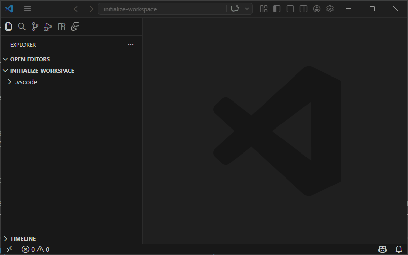

# Initialize workspace

**Command:** `Memoria: Initialize workspace`  
**Available:** Always

Scaffolds the workspace with a folder structure based on the selected blueprint template. This is the first command you run after installing Memoria.

1. Open the Command Palette and run **Memoria: Initialize workspace**
2. If your workspace already has a `.memoria/` folder, you will be prompted to reinitialize
3. Select a blueprint template from the list
4. Memoria creates the folder structure, default files, and configuration

See [Blueprint Templates](../blueprints/index.md) for what each template includes.

### Reinitialization conflict resolution

When you reinitialize, Memoria automatically detects conflicts and guides you through two quick steps:

1. **Extra folders** — A checklist shows any top-level folders on disk that the new blueprint does not define. All are checked (kept) by default. Uncheck any you want moved to `WorkspaceInitializationBackups/`.
2. **Modified files** — A checklist shows all files that differ from what the blueprint expects (either files you edited, or files you created that clash with a new blueprint file). All will be overwritten regardless. Check any you want to review side-by-side in a diff editor afterward.

After you confirm both steps:
- Blueprint files are written unconditionally
- Your old versions of every conflicting file are saved to `WorkspaceInitializationBackups/` (same relative path) before being overwritten
- Diff editors open (in batches) for any files you checked in step 2 — left side is your old version, right side is the new blueprint version

> **Note:** If a newer version of your blueprint is available, Memoria will prompt you to reinitialize when VS Code starts.

---

[⬅️ **Back** to Commands](index.md) 💠 [Getting Started](../getting-started.md) 💠 [FAQ](../faq.md)