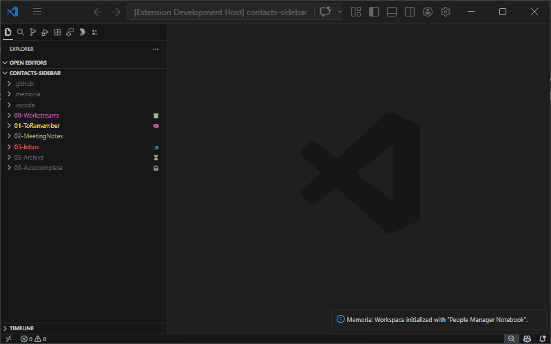

# Contacts

The Contacts feature adds a dedicated **Contacts** sidebar to Memoria for browsing, searching, and maintaining the people records stored in your blueprint's contacts folder.

## What it manages

Contacts are stored as Markdown dictionaries in the blueprint-owned people folder:

- **People Manager** workspaces use `06-Contacts/`
- **Individual Contributor** workspaces use `05-Contacts/`

Each contact group is a single Markdown file such as `Team.md` or `Colleagues.md`. Reference data lives under `DataTypes/` in the same folder.

## Person types

- **Report**: Available only in the People Manager blueprint. Reports track `CareerPathKey`, `LevelId`, `LevelStartDate`, and an auto-generated title.
- **Colleague**: Available in both bundled blueprints. Colleagues track the shared profile fields and choose a title from the generated title list.
- **Custom groups**: You can create additional groups from the sidebar form. Custom groups always use the colleague field set.

## Sidebar workflow

The sidebar is optimized for narrow widths:

- Search by nickname, full name, id, or title
- Browse contacts grouped by their backing Markdown file
- Click a contact row to edit it
- Use the inline actions to edit, move, or delete
- Use the `+` button to add a new contact or create a new group

## Reference data

Reference data is stored in editable Markdown files under `DataTypes/`:

- `Pronouns.md`
- `CareerLevels.md`
- `CareerPaths.md`
- `InterviewTypes.md`

The sidebar reloads when these files change. If a contact or career level points to a missing reference entry, Memoria rewrites the missing key to `unknown` so the data remains usable.

## Moving between groups

Moving a person physically moves the record between group files.

- **Report -> Colleague** keeps `LevelId` and `LevelStartDate` under `_droppedFields`
- **Colleague -> Report** restores those dropped fields when available and asks for any missing report-only data before saving

## Commands

- `Memoria: Add Person`
- `Memoria: Edit Person`
- `Memoria: Delete Person`
- `Memoria: Move Person`

These commands are available only while the Contacts feature is active.

## Tips

- Use `Memoria: Manage features` to enable or disable Contacts without reloading VS Code.
- Edit the Markdown files directly if you prefer bulk changes or need to preserve a custom title not present in the generated list.
- If the sidebar seems stale after a large external edit, save the file again or reload the window so the watcher can re-scan the contacts folder.

---

[⬅️ **Back** to Features](index.md) 💠 [Commands](../commands/index.md) 💠 [Getting Started](../getting-started.md)
