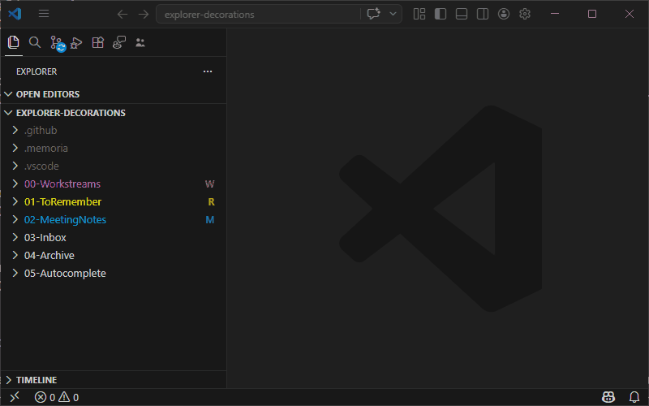

# Explorer Decorations

Adds color-coded badges and labels to folders in the VS Code file explorer. These visual cues help you quickly identify folder purposes at a glance.

## How it works

Each blueprint defines decoration rules that map folders to colors, badges, and tooltips. The rules use VS Code theme colors (e.g., `charts.yellow`, `charts.blue`) so they adapt to your current theme.

Some decorations **propagate** to child items — for example, a decoration on `00-ToDo/` applies to all files and subfolders inside it.

## Toggling

1. Open the Command Palette (`Ctrl+Shift+P`)
2. Run **Memoria: Manage features**
3. Check or uncheck **Explorer Decorations**

Changes take effect immediately — no restart required.

## IntelliSense

When editing `.memoria/decorations.json`, Memoria provides:

- **Auto-completion** for rule field names, filter patterns, color values, and booleans
- **Inline color picker** for theme color IDs — pick a color and it maps to the closest VS Code theme color

Decoration rules are also updated **live** — any saved change to `decorations.json` is reflected in the Explorer immediately without reloading.

## Troubleshooting

- **Badges/colors not showing?** Make sure the feature is enabled via **Memoria: Manage features**
- **Wrong colors?** Edit the rules in `.memoria/decorations.json` — changes are picked up live. Color values use VS Code theme color IDs (e.g., `charts.yellow`, `charts.blue`) so they adapt to your current theme
- **Still not working?** Try reloading VS Code (`Ctrl+Shift+P` → **Developer: Reload Window**)

---

[⬅️ **Back** to Features](index.md) 💠 [Getting Started](../getting-started.md) 💠 [FAQ](../faq.md)
