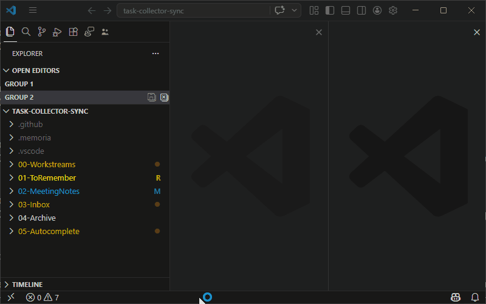
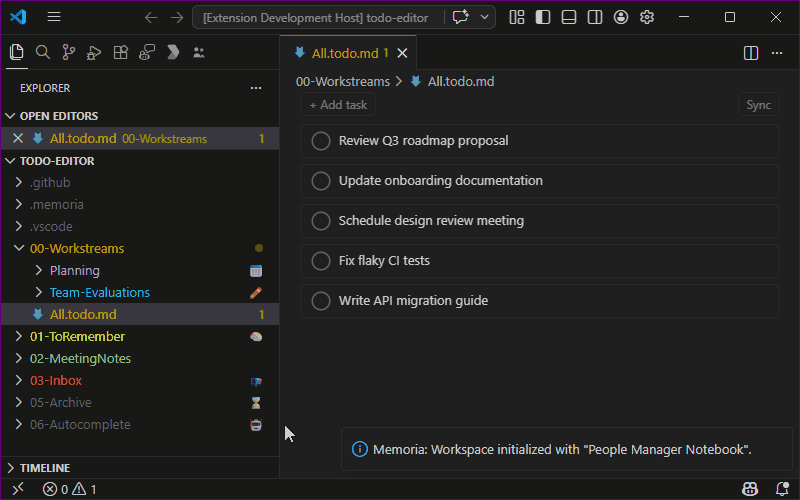

# Task Collector

Aggregates every Markdown task (`- [ ]` / `- [x]`) from across all workspace files into a single **collector file**, keeps it in two-way sync with the source files, and automatically manages completed tasks.

## How it works

Whenever you **save** a Markdown file, Memoria reconciles its tasks with the collector:

- New tasks are added to the `# To do` section of the collector.
- Tasks edited or deleted in a source file are reflected in the collector.
- Tasks checked off (in either the collector or a source file) are moved to the `# Completed` section with a completion date.
- Completed tasks older than the configured retention window are pruned from the collector; the originating source line is rewritten to `- **Done**: <body>` so it is never re-ingested.

You can also **add tasks directly in the collector** (no source file required). These "manual" tasks live only in the collector and sync back to it on every reconcile.

> **Source files are never modified by Memoria** except to propagate checkbox state changes (`[ ]` ↔ `[x]`) and to mark aged-out completions as done. No identity markers or comments are inserted.



## Collector file

The collector file path is determined by your blueprint and materialized into the workspace at init time. Its location is stored in `.memoria/` — it cannot be changed without re-initializing with a different blueprint.

The collector has two sections:

```markdown
# To do

- [ ] Write the weekly update
- [ ] Review the proposal
      With multiple continuation lines if needed

# Completed

- [x] Send onboarding docs
   _Source: docs/onboarding.md · Completed 2026-04-14_
```

- **Active tasks** are plain Markdown — no metadata in the body.
- **Completed tasks** get an italic suffix line showing the source file and completion date.
- You may freely **reorder** tasks within each section (`# To do` and `# Completed`); the engine preserves your ordering across subsequent syncs.

## Toggling

1. Open the Command Palette (`Ctrl+Shift+P`)
2. Run **Memoria: Manage features**
3. Check or uncheck **Task Collector**

Changes take effect immediately — no restart required.

## Sync on demand

Run **Memoria: Sync Tasks** from the Command Palette to trigger a full workspace sync at any time.

## Configuration

Runtime settings are stored in `.memoria/task-collector.json`:

```json
{
  "completedRetentionDays": 7,
  "syncOnStartup": true,
  "include": ["**/*.md"],
  "exclude": ["**/node_modules/**", "**/.git/**", "**/.memoria/**"],
  "debounceMs": 300
}
```

| Setting | Default | Description |
|---------|---------|-------------|
| `completedRetentionDays` | `7` | Days before a completed task is pruned from the collector |
| `syncOnStartup` | `true` | Run a full sync when VS Code starts (non-blocking) |
| `include` | `["**/*.md"]` | Glob patterns for files to scan |
| `exclude` | `["**/node_modules/**", …]` | Glob patterns for files to skip |
| `debounceMs` | `300` | Debounce window (ms) for rapid consecutive saves |

> The collector file and `WorkspaceInitializationBackups/` are always excluded regardless of the above settings.

## Troubleshooting

- **Tasks not appearing in the collector?** Make sure the feature is enabled via **Memoria: Manage features** and that the file was saved after adding the task (sync fires on save, not on every keystroke).
- **Collector file not found?** The collector path comes from the blueprint. If your blueprint does not include a `taskCollector` entry, this feature will remain inactive even when enabled.
- **Sync not starting on startup?** Set `syncOnStartup: true` in `.memoria/task-collector.json`.
- **Still not working?** Try running **Memoria: Sync Tasks** manually or reloading VS Code (`Ctrl+Shift+P` → **Developer: Reload Window**).

## Todo Editor

`*.todo.md` files open in a **visual task board** by default.

<!-- TODO: uncomment when todo-editor.gif is recorded -->
<!--  -->

### Card layout

Each active task is displayed as a card with:
- **Drag handle** (`⠿`) — visible on hover, drag to reorder tasks.
- **Checkbox** — click to complete (active → completed with today's date) or un-complete (completed → active).
- **Task body** — rendered as full markdown (bold, italic, inline code, links, lists).
- **Source link** (`🔗`) — visible on hover for collected tasks; click to open the originating source file beside the editor.

### Interactions

| Action | How |
|--------|-----|
| **Complete a task** | Click the checkbox on an active task |
| **Un-complete a task** | Expand the Completed section, click the checkbox |
| **Reorder tasks** | Drag and drop active task cards |
| **Add a task** | Click `+ Add task` in the toolbar, or press `a` / `n` |
| **Edit a task** | Double-click a task card body |
| **Open source file** | Click the source link icon on a collected task |
| **Sync** | Click the `Sync` button in the toolbar |

### Add task popup

- **Single-line mode** (default): type text, press **Enter** to confirm.
- Press **Shift+Enter** to switch to multi-line mode (textarea).
- In multi-line mode: **Enter** adds newlines, **Shift+Enter** confirms.
- **Escape** or clicking the backdrop cancels.

### Completed section

A collapsible section at the bottom of the editor (collapsed by default). Completed tasks show their completion date as a badge. Click a completed task's checkbox to move it back to active.

### Collector integration

When the Task Collector feature is enabled for the current workspace, the Todo Editor also integrates with the collector index:

- The `Sync` toolbar button runs **Memoria: Sync Tasks**.
- Collected tasks can resolve their source files for the source-link action.

When the feature is disabled, the file still opens in the Todo Editor and remains editable, but `Sync` shows the same "Task Collector is not enabled for this workspace" error as the command.

---

[⬅️ **Back** to Features](index.md) 💠 [Getting Started](../getting-started.md) 💠 [FAQ](../faq.md)
